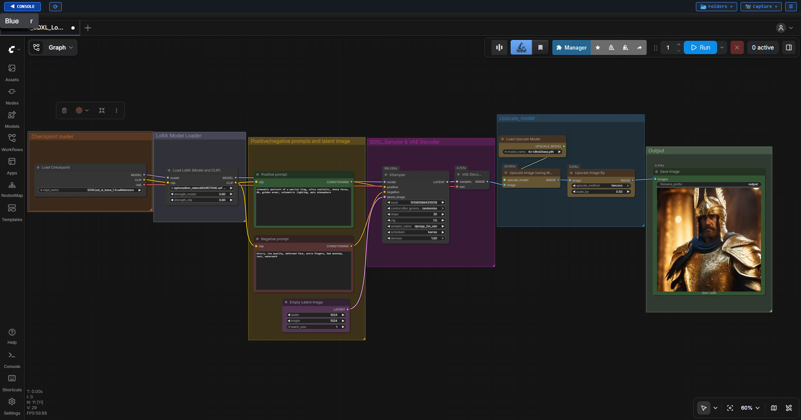

# ComfyUI SDXL + LoRA + Upscaling Workflow

A production-oriented ComfyUI workflow designed for high-quality image generation using Stable Diffusion XL, LoRA integration, and AI-powered upscaling.

This project demonstrates practical workflow design principles used in Generative AI pipelines, focusing on scalability, reusability, and production efficiency.

---

## Project Overview

This workflow was developed to explore and optimize image generation pipelines using ComfyUI while maintaining a balance between image quality, performance, and resource utilization.

The workflow integrates:

* Stable Diffusion XL (SDXL)
* LoRA-based style enhancement
* Prompt conditioning
* Latent image generation
* AI upscaling
* Production workflow optimization

---

## Architecture Diagram


---

## Workflow Graph



---

## Sample Outputs

### Output 01


### Output 02


### Output 03


### Output 04


---

## Workflow Structure

```text
Checkpoint Loader
        ↓
LoRA Loader
        ↓
Positive Prompt Encoder
        ↓
Negative Prompt Encoder
        ↓
Empty Latent Image
        ↓
KSampler
        ↓
VAE Decode
        ↓
Upscaler
        ↓
Save Image
```

---

## Key Features

### SDXL Integration

Utilizes Stable Diffusion XL as the primary image generation model.

### LoRA Support

Applies specialized visual styles and fine-tuned model enhancements.

### Efficient Sampling

Optimized KSampler settings for improved image quality and generation speed.

### AI Upscaling

Generates images at efficient resolutions and upscales for high-resolution output.

### Reusable Design

Built as a modular workflow that can be expanded with:

* ControlNet
* IPAdapter
* Flux
* Video Generation Pipelines
* Custom Nodes

---

## Technical Stack

| Category          | Technology    |
| ----------------- | ------------- |
| Workflow Engine   | ComfyUI       |
| Base Model        | SDXL          |
| Style Enhancement | LoRA          |
| Sampling          | DPM++ 2M SDE  |
| Scheduler         | Karras        |
| Upscaling         | 4x UltraSharp |
| Version Control   | Git           |
| Documentation     | Markdown      |

---

## 📚 Documentation

Detailed documentation is available in the following files:

### 🔹 Node Explanations

Provides detailed explanations of every node used in the workflow.

➡️ [View Node Explanations](docs/node_explanations.md)

---

### 🔹 Optimization Notes

Documents workflow experiments, parameter testing, optimization strategies, and lessons learned.

➡️ [View Optimization Notes](docs/optimization_notes.md)

---

## Learning Objectives

This project helped develop practical experience in:

* ComfyUI Workflow Design
* Stable Diffusion Architecture
* LoRA Integration
* Prompt Engineering
* Sampling Optimization
* Production-Oriented Workflow Development
* AI Pipeline Documentation

---

## Future Improvements

Planned enhancements include:

* ControlNet Integration
* OpenPose Workflows
* IPAdapter Character Consistency
* Flux Workflows
* AI Video Generation
* Custom ComfyUI Nodes
* Workflow Automation

---

## Author

### Gowtham Subramanian

Generative AI Workflow Designer | Technical Artist | Senior Digital Compositor

#### Experience

* DNEG
* MPC
* BOT VFX
* Ingenuity Studios

#### Connect

LinkedIn:
https://www.linkedin.com/in/gowtham-subramanian-9a141939b/

Showreel:
https://vimeo.com/858890877

Email:
[gowthamvfx150290@gmail.com](mailto:gowthamvfx150290@gmail.com)
