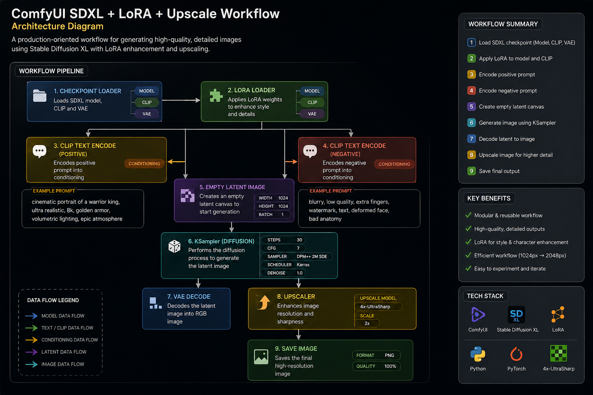

# ComfyUI SDXL + LoRA + Upscaling Workflow

## Overview

This project demonstrates a production-oriented ComfyUI workflow for generating high-quality photorealistic character imagery using SDXL, LoRA models, and image upscaling.

The goal of this workflow is to create a reusable and scalable pipeline that can be used by artists for concept development, character exploration, marketing imagery, and previsualization.

---

# Workflow Architecture

```text
Checkpoint Loader
        │
        ▼
    LoRA Loader
        │
 ┌──────┴──────┐
 ▼             ▼
Positive     Negative
Prompt       Prompt
Encoder      Encoder
      │      │
      ▼      ▼
       KSampler
           │
           ▼
      VAE Decode
           │
           ▼
       Upscaling
           │
           ▼
       Save Image
```

---

# Workflow Screenshot



---

# Final Output


---

# Technologies Used

| Tool            | Purpose                         |
| --------------- | ------------------------------- |
| ComfyUI         | Node-based workflow system      |
| SDXL Base Model | Core image generation           |
| LoRA Models     | Style and character enhancement |
| KSampler        | Diffusion sampling process      |
| VAE Decoder     | Convert latent data into image  |
| 4x UltraSharp   | Image upscaling                 |
| Python          | Workflow customization          |
| Git             | Version control                 |

---

# Workflow Components

---

## 1. Checkpoint Loader

### Purpose

Loads the primary Stable Diffusion model.

### Why this node?

The workflow requires a base model before any image generation can occur.

This node provides:

* Model
* CLIP
* VAE

which are required by downstream nodes.

### Output

* MODEL
* CLIP
* VAE

---

## 2. LoRA Loader

### Purpose

Applies specialized knowledge to the base model.

### Why this node?

Training an entire model is expensive.

LoRA allows style adaptation without retraining the full model.

Examples:

* Realism enhancement
* Character styles
* Cinematic lighting
* Environment styles

### Benefits

* Lightweight
* Modular
* Easy experimentation

---

## 3. CLIP Text Encode (Positive)

### Purpose

Converts the positive prompt into embeddings.

### Why this node?

The model cannot understand plain text directly.

CLIP converts text into numerical representations that the model can process.

### Example Prompt

```text
cinematic portrait of a warrior king,
ultra realistic,
8k,
golden armor,
volumetric lighting
```

---

## 4. CLIP Text Encode (Negative)

### Purpose

Defines unwanted features.

### Why this node?

Negative prompts improve output quality by reducing common generation errors.

### Example Prompt

```text
blurry,
low quality,
extra fingers,
watermark,
text,
deformed face
```

---

## 5. Empty Latent Image

### Purpose

Creates the initial latent canvas.

### Why this node?

The diffusion process requires a latent space to begin image generation.

### Settings

```text
Width: 1024
Height: 1024
Batch Size: 1
```

---

## 6. KSampler

### Purpose

Core image generation node.

### Why this node?

This is where the diffusion process happens.

The model progressively removes noise until a coherent image is created.

### Production Settings

```text
Steps: 30
CFG: 7
Sampler: DPM++ 2M SDE
Scheduler: Karras
```

### Why These Values?

#### Steps = 30

Provides a balance between:

* Quality
* Speed

#### CFG = 7

Maintains prompt adherence while preserving creativity.

#### DPM++ 2M SDE

Produces stable and detailed outputs.

#### Karras Scheduler

Commonly used for high-quality SDXL workflows.

---

## 7. VAE Decode

### Purpose

Converts latent information into a visible image.

### Why this node?

The KSampler output is not an image.

It is latent data.

The VAE Decoder transforms that latent representation into a viewable image.

---

## 8. Upscaling

### Purpose

Increase image resolution.

### Why this node?

Generating directly at very high resolutions requires significantly more VRAM and processing time.

Upscaling provides:

* Faster workflow execution
* Better detail retention
* Higher final resolution

### Upscale Model

```text
4x UltraSharp
```

### Workflow

```text
1024x1024
      ↓
2048x2048
```

---

# Workflow Optimization Decisions

## Why SDXL?

* Strong photorealism
* Large community support
* Excellent LoRA ecosystem

---

## Why LoRA Instead of Additional Models?

* Faster experimentation
* Lower storage requirements
* Modular workflow design

---

## Why Generate at 1024 First?

Benefits:

* Lower GPU usage
* Faster iterations
* Easier testing

---

## Why Upscale Afterwards?

Benefits:

* Better efficiency
* Improved visual quality
* Production-friendly workflow

---

# Challenges Encountered

### Prompt Overfitting

High CFG values reduced image quality.

Solution:

```text
CFG = 6-8
```

---

### LoRA Overpowering

High LoRA strength produced unrealistic outputs.

Solution:

```text
Strength = 0.6 - 0.9
```

---

### Excessive Sampling Steps

Increasing beyond 40 steps produced minimal improvements.

Solution:

```text
25-30 steps
```

---

# Future Improvements

* ControlNet Integration
* OpenPose Workflow
* IPAdapter Character Consistency
* Multi-LoRA Blending
* Flux Model Migration
* Video Generation Pipelines

---

# Key Learnings

* Understanding latent diffusion workflows
* Prompt engineering techniques
* LoRA integration strategies
* Sampling optimization
* Production-oriented workflow design
* Workflow scalability and reusability

---

# Author

Gowtham Subramanian

Generative AI Workflow Designer | Technical Artist | Senior Digital Compositor

LinkedIn:
https://www.linkedin.com/in/gowtham-subramanian-9a141939b/

Showreel:
https://vimeo.com/858890877
